### PanNuke Tissue Classification
### Dataset
**PanNuke**
- **PanNuke** is a histopathology dataset consisting of H&E-stained tissue images from multiple tissue types.

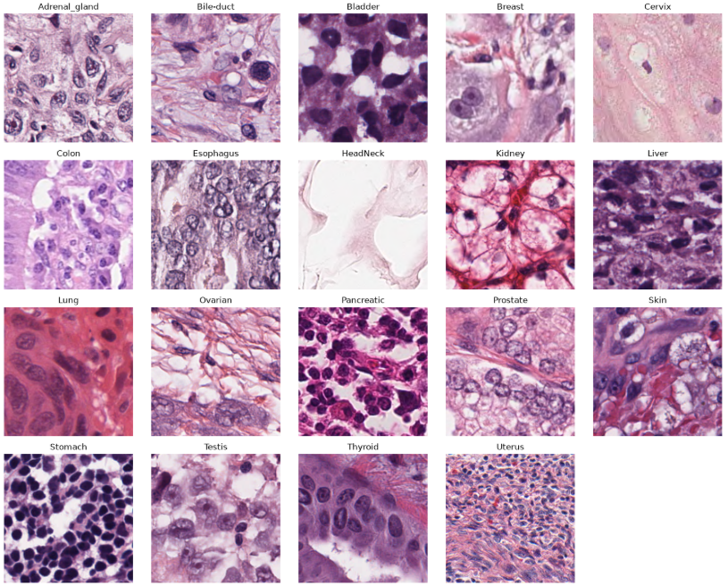

- 19 tissue classes
  - Adrenal gland, Bile duct, Bladder, Breast, Cervix, Colon, Esophagus, Head and Neck, Kidney, Liver, Lung, Ovarian, Pancreatic, Prostate, Skin, Stomach, Testis, Thyroid, and Uterus.
- Image size : 256×256 pixels
- Three predefined folds
  - Fold 1: Training — 2,656 images
  - Fold 2: Validation — 2,523 images
  - Fold 3: Test — 2,722 images
- Tissue labels were used for the classification task

### Models
#### 1. ResNet-50
A convolutional neural network based on residual connections, which help train deeper networks by allowing information to skip across layers.
#### 2. DenseNet-121
A convolutional neural network that connects each layer to all subsequent layers within a dense block, encouraging feature reuse and efficient information flow.
#### 3. Swin-T
A hierarchical Vision Transformer that first splits the image into 4×4 patches and applies self-attention within local windows. As the network goes deeper, neighboring patches are merged, allowing the model to learn features at multiple spatial scales.
#### 4. ViT-B/16
A vanilla Vision Transformer that splits the image into 16×16 patches, converts them into tokens, and applies global self-attention across all patch tokens to learn relationships between different regions of the image.ion.

### Matrics
Since our dataset is imbalanced, I’d use validation **macro-F1** as the main criterion rather than validation accuracy.

## Overall Experiment Results

| Experiment | Model / Setting | Input Size | Epochs | Best Epoch | Best Val Macro-F1 |
|---|---|---:|---:|---:|---:|
| EX1 | ResNet-50 + lr=1e-4 | 256×256 | 20 | 9 | 0.8671 |
| EX2 | ResNet-50 + lr=1e-4 + augmentation | 256×256 | 20 | 18 | 0.8942 |
| EX3 | ResNet-50 + lr=1e-4 + augmentation, seed 42 | 256×256 | 30 | 26 | 0.9176 |
| EX4-1 | ResNet-50, lr=5e-5, seed 42 | 256×256 | 30 | 30 | 0.9051 |
| EX4-2 | ResNet-50, lr=5e-5, seed 42 | 256×256 | 50 | 39 | **0.9212** |
| EX5 | ResNet-50 + weight decay (1e-4) | 256×256 | 50 | 45 | 0.9155 |
| EX6 | ResNet-50 + class-weighted cross-entropy | 256×256 | 50 | 40 | 0.9190 |
| EX7 | DenseNet-121, EX4 settings | 256×256 | 50 | 45 | 0.9151 |
| EX8-1 | Swin-T, EX4 settings | 256×256 | 50 | 47 | **0.9306** |
| EX8-2 | Swin-T, extended training | 256×256 | 100 | 47 | 0.9306 |
| EX9 | ViT-B/16, EX4-based settings | 224×224 | 50 | 22 | 0.9171 |

## Final Model Selection for PanNuke Tissue Classification
**Swin-T (EX8-1)** outperformed both CNN baselines and the vanilla ViT-B/16 model under the current experimental setup. Weight decay and class-weighted loss did not improve the best ResNet-50 baseline.  

The selected Swin-T model achieved a final test Macro-F1 of 0.8901 and an accuracy of 0.9324 on Fold 3. Compared with the Validation Macro-F1 of 0.9306 (EX8-1), performance decreased on held-out test fold (Fold 3), indicating a generalization gap across folds.

### Confusion Matrix Analysis

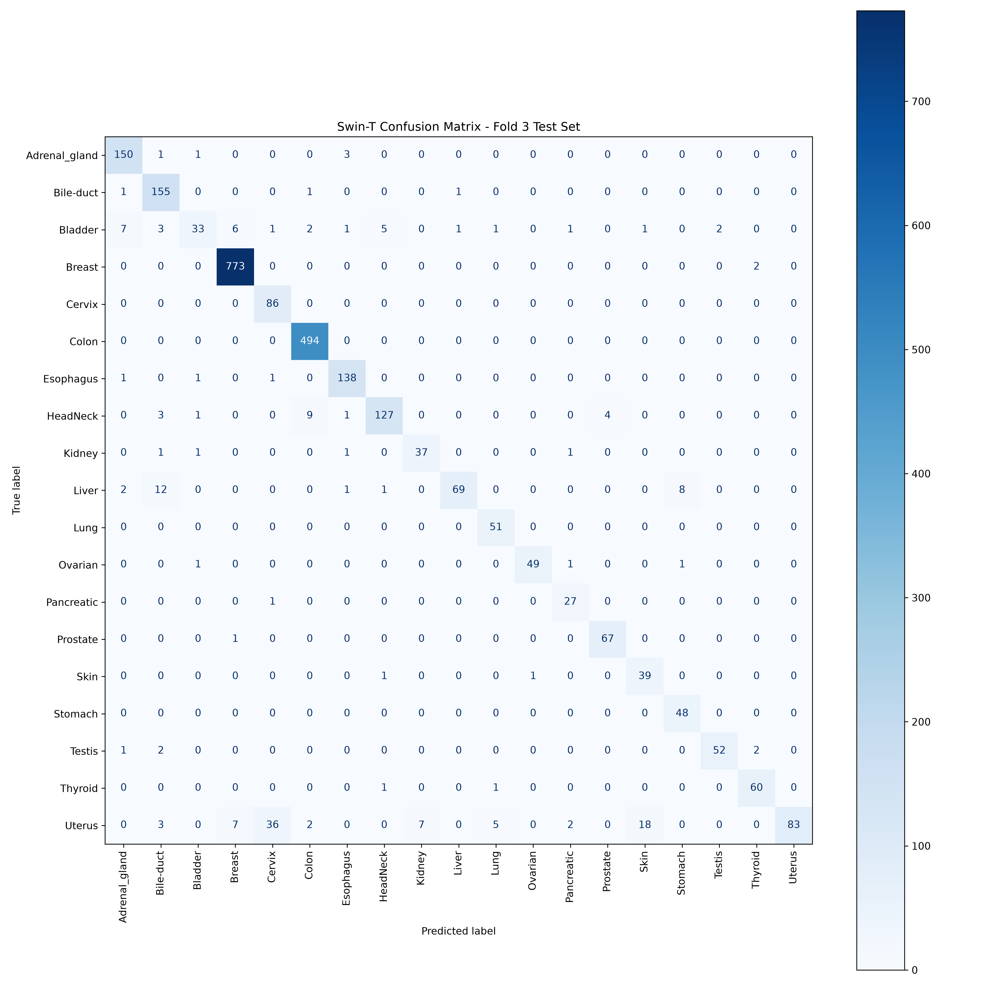
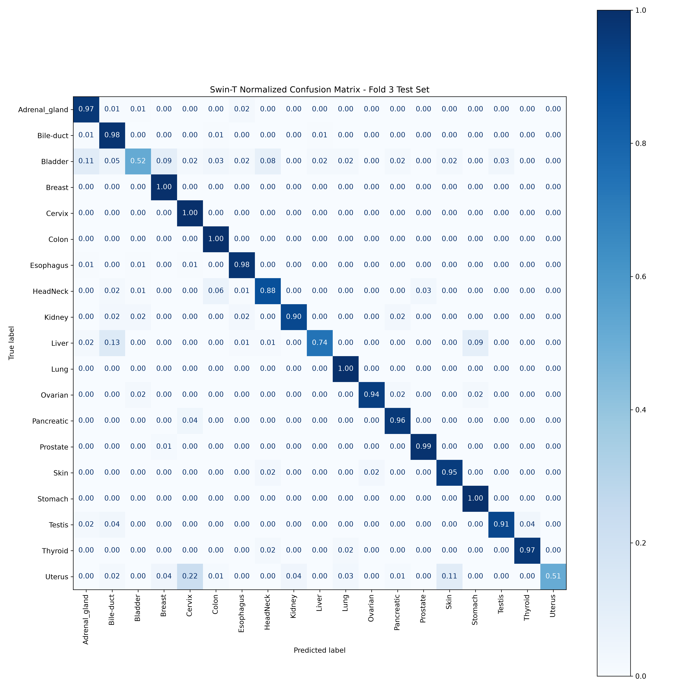

 

The normalized confusion matrix revealed several notable misclassification patterns:

- 11% of Bladder samples were misclassified as Adrenal gland.
- Bladder samples were also confused with Breast (9%) and HeadNeck (8%).
- Liver showed relatively high confusion with Bile-duct (13%) and Stomach (9%).
- The most prominent confusion was observed between Uterus and Cervix, with 22% of Uterus samples misclassified as Cervix.  

 

### Uterus–Cervix Misclassification Analysis

The normalized confusion matrix showed that **22% of Uterus samples were misclassified as Cervix**, which was the most prominent off-diagonal misclassification observed in the test set.

To further examine this pattern, Uterus samples that were misclassified as Cervix were visually compared with correctly classified Cervix samples.

  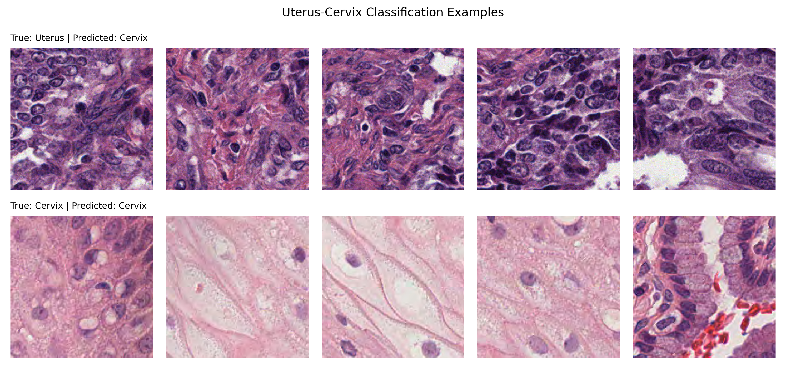

  <em>
    Top: Uterus samples misclassified as Cervix.  
       
    Bottom: correctly classified Cervix samples.
  </em>

Visual inspection shows substantial variation within the Cervix samples, while some misclassified Uterus samples exhibit visual patterns that may overlap with those observed in Cervix samples. This suggests that morphological similarity may contribute to the Uterus-to-Cervix misclassification. However, further analysis would be required to determine which specific histological features contribute to this confusion.

- As a potential direction for improving generalization, additional color augmentation could be explored during training. Since histopathology images can exhibit variations in staining intensity and color distribution, augmentations such as brightness, contrast, saturation, or hue adjustments may help the model become more robust to these variations.

### Fixed Experimental Setup

- Model: ResNet-50
- Pretraining: ImageNet pretrained weights
- Train split: PanNuke Fold 1
- Validation split: PanNuke Fold 2
- Number of classes: 19
- Loss function: CrossEntropyLoss
- Input size: 256 × 256
- Normalization: ImageNet mean/std
- Checkpoint criterion: Best validation macro-F1

### ResNet-50 Baseline Training

#### EX1
#### Hyperparameters and Training Configuration

- Batch size: 32
- Optimizer: Adam
- Learning rate: 1e-4
- epochs: 20
- Data augmentation: None
- Regularization: None

  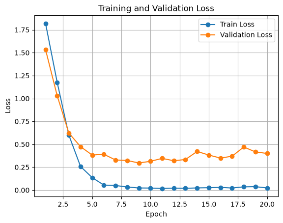
  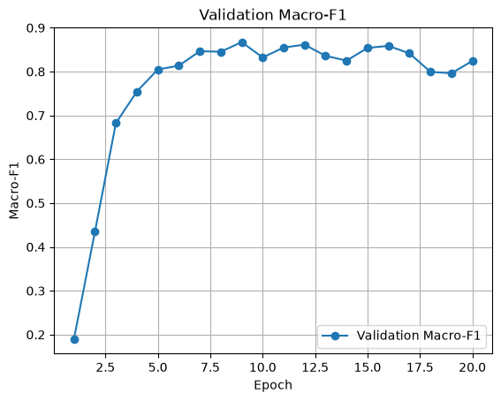

- Macro F1: 0.8671
- Best checkpoint : Epoch 9 / 20

 

- Training loss continued to decrease, while validation performance
peaked around epoch 9 and then began to plateau or worsen.
    - This indicates the onset of overfitting.
    - In the next experiment, data augmentation, regularization, and learning-rate adjustment will be explored to reduce overfitting.

#### EX2
- Batch size: 32
- Optimizer: Adam
- Learning rate: 1e-4
- epochs: 20
- Data augmentation: Yes
- Regularization: None

  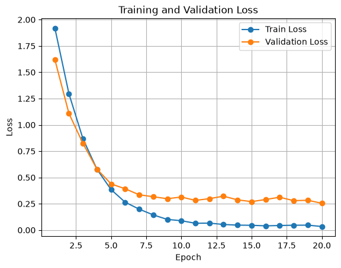
  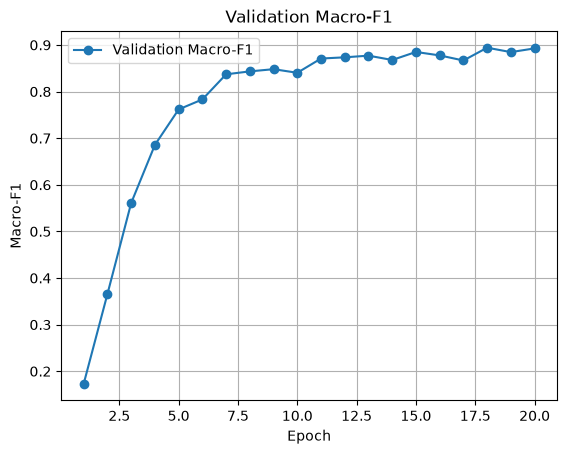

- Macro F1: 0.8942
- Best checkpoint : Epoch 18 / 20

 

- Validation performance remained stable through later epochs.
    - Data augmentation improved generalization and delayed overfitting.
    - In the next experiment, training will be extended to 30 epochs.

#### EX3
- Batch size: 32
- Optimizer: Adam
- Learning rate: 1e-4
- epochs: 30
- Data augmentation: Yes
- Regularization: None

  
  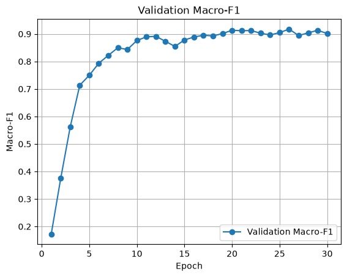

- Best Val Macro-F1: 0.9176
- Best checkpoint: Epoch 26 / 30

 

- Validation Macro-F1 continued to improve after Epoch 20 and reached its highest value at Epoch 24.
    - Extending training from 20 to 30 epochs improved the best validation Macro-F1 from 0.8942 to 0.9203.
    - After Epoch 24, validation performance fluctuated without further improvement.
    - In the next experiment, the learning rate will be reduced to 5e-5 to achieve more stable optimization and potentially improve validation performance.

#### EX4
- Batch size: 32
- Optimizer: Adam
- Learning rate: 5e-5
- epochs: 30 -> 50
- Data augmentation: Yes
- Regularization: None

  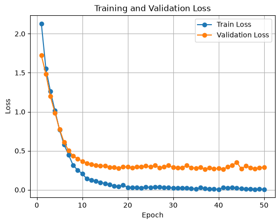
  

- Best Val Macro-F1: 0.9051 -> 0.9212
- Best checkpoint: Epoch 30 -> 39 / 

 

- The best checkpoint was reached at the final epoch (Epoch 30), so training will be extended to 50 epochs to allow further convergence.
- With 50 epochs, the best checkpoint (Epoch 39, Macro-F1 0.9212) suggests that the lower learning rate required more epochs to converge, but eventually achieved slightly better validation performance.
- In the next experiment, weight decay will be added to examine whether regularization can improve generalization.

#### EX5
- Batch size: 32
- Optimizer: Adam
- Learning rate: 5e-5
- epochs: 50
- Data augmentation: Yes
- Regularization: 
  - weight decay : 1e-4

  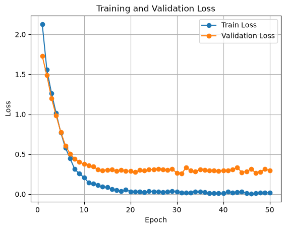
  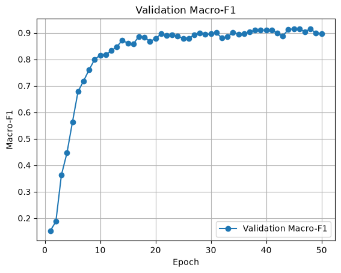

- Best Val Macro-F1: 0.9155
- Best checkpoint: Epoch 45

 

- Adding weight decay did not improve validation performance compared with the previous experiment (0.9212).
- It did not lead to a clear improvement in generalization.
- In the next experiment, let's handle class imbalance with class weighting.

#### EX6
- Batch size: 32
- Optimizer: Adam
- Learning rate: 5e-5
- epochs: 50
- Data augmentation: Yes
- Regularization: None
- class-weighted cross-entropy

  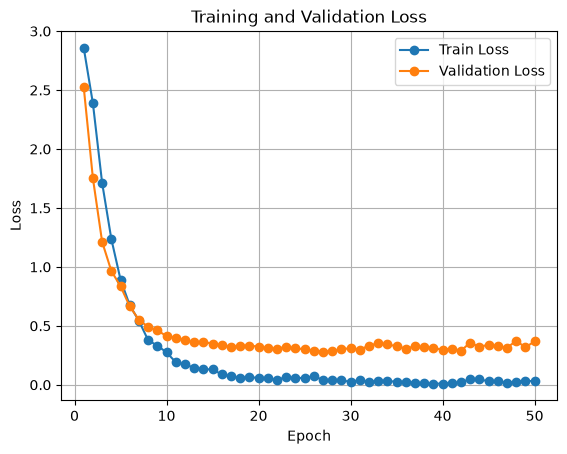
  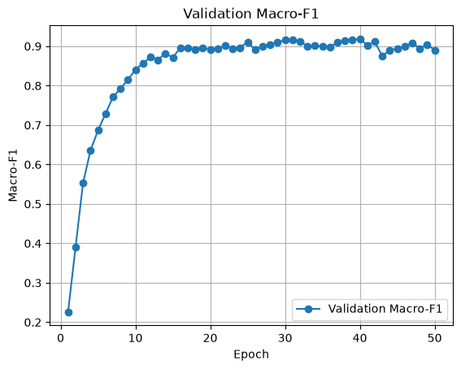

- Best Val Macro-F1: 0.9190
- Best checkpoint: Epoch 40

 

- Class-weighted cross-entrpy did not improve the best validation Macro-F1 compaared with the previous setting (0.9212)
- The next step is to examine per-class F1/recall to determine whether minority-class performance improved despite the similar overall Macre-F1
  - Class-weighted loss improved F1 scores for Liver, Bile-duct, and Esophagus, but reduced F1 scores for classes such as Bladder and Stomach. Overall Macro-F1 also slightly decreased from 0.9212 (EX4) to 0.9190. 

### DenseNet-121 Baseline Training
I use the EX4 settings as the starting point.
#### EX7
- Batch size: 32
- Optimizer: Adam
- Learning rate: 5e-5
- epochs: 50
- Data augmentation: Yes
- Regularization: None

  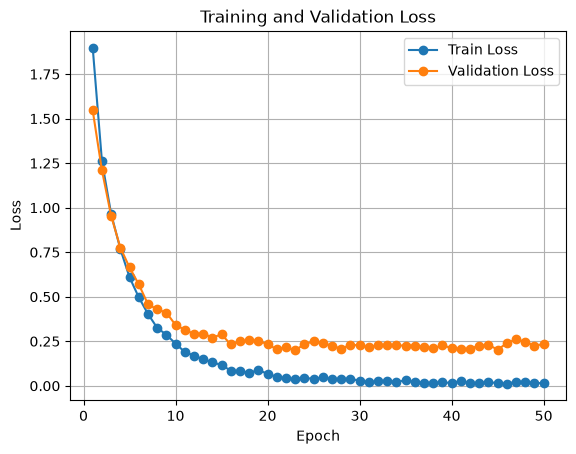
  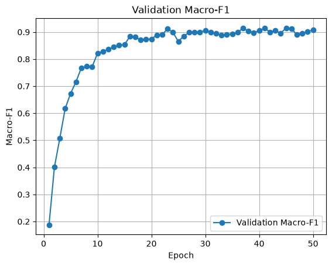

- Best Val Macro-F1: 0.9151
- Best checkpoint: Epoch 45

 

- Under the same training settings as EX4, which was the best-performing setting so far, ResNet-50 slightly outperformed DenseNet-121 on the validation set in terms of Macro-F1.

### Swim-T Baseline Training
I use the EX4 settings as the starting point.
- patch size : 4 x 4

#### EX8
- Batch size: 32
- Optimizer: Adam
- Learning rate: 5e-5
- epochs: 50 -> 100
- Data augmentation: Yes
- Regularization: None

  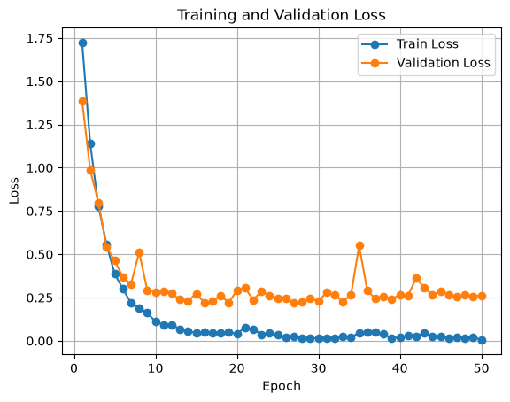
  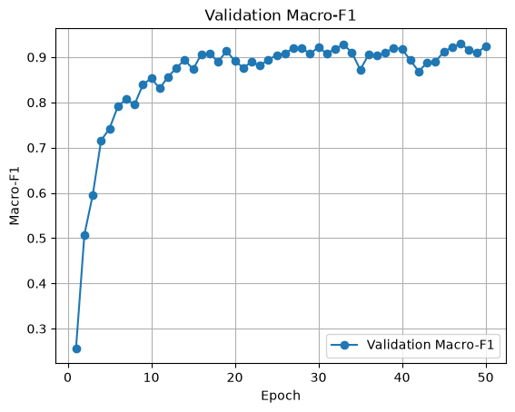

- Best Val Macro-F1: 0.9306 / 0.9306
- Best checkpoint: Epoch 47 / 47

 

- Swim-T outperformed the EX4 ResNet-50 setting in terms of validation Macro-F1.
- To check whether the validation Macro-F1 can reach a slightly better optimum despite the late-stage fluctuations, we extend training by 50 additional epochs.
  - It turns out that the best validation Macro-F1 is exactly the same as in the 50-epoch run.

### ViT-B/16
I use the EX4 settings as the starting point.
- Input size: 224 × 224
  - ViT-B/16 was trained with 224 x 224 inputs to match the pretrained model's expected input resolution.
- patch size : 16 x 16

#### EX9
- Batch size: 32
- Optimizer: Adam
- Learning rate: 5e-5
- epochs: 50
- Data augmentation: Yes
- Regularization: None

  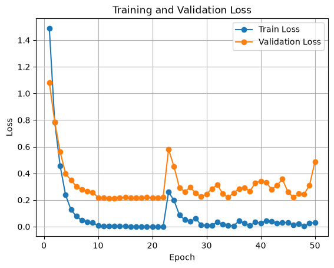
  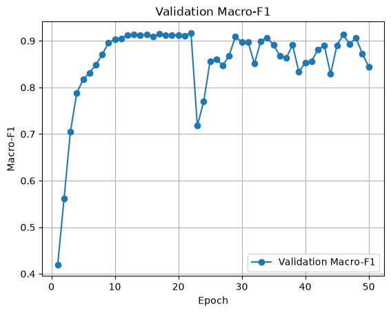

- Best Val Macro-F1: 0.9171 
- Best checkpoint: Epoch 22

 

- Validation performance became unstable after approximately 20 epochs, with noticeable fluctuations in both validation and Macro-F1. 

### References
[panNuke dataset](https://warwick.ac.uk/fac/cross_fac/tia/data/pannuke/)  
[pathml](https://github.com/Dana-Farber-AIOS/pathml)

#### Model Papers
- [ResNet-50 — Deep Residual Learning for Image Recognition](https://openaccess.thecvf.com/content_cvpr_2016/html/He_Deep_Residual_Learning_CVPR_2016_paper.html)  
  CVPR 2016

- [DenseNet-121 — Densely Connected Convolutional Networks](https://openaccess.thecvf.com/content_cvpr_2017/html/Huang_Densely_Connected_Convolutional_CVPR_2017_paper.html)  
  CVPR 2017

- [Swin-T — Swin Transformer: Hierarchical Vision Transformer Using Shifted Windows](https://openaccess.thecvf.com/content/ICCV2021/html/Liu_Swin_Transformer_Hierarchical_Vision_Transformer_Using_Shifted_Windows_ICCV_2021_paper.html)  
  ICCV 2021

- [ViT-B/16 — An Image Is Worth 16x16 Words: Transformers for Image Recognition at Scale](https://openreview.net/forum?id=YicbFdNTTy)  
  ICLR 2021
