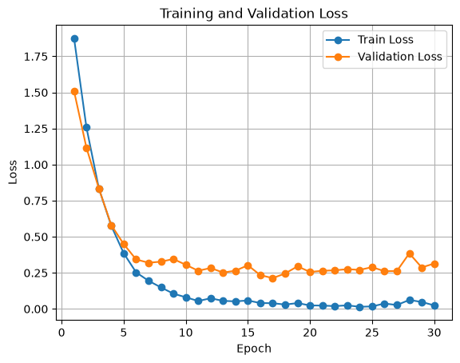
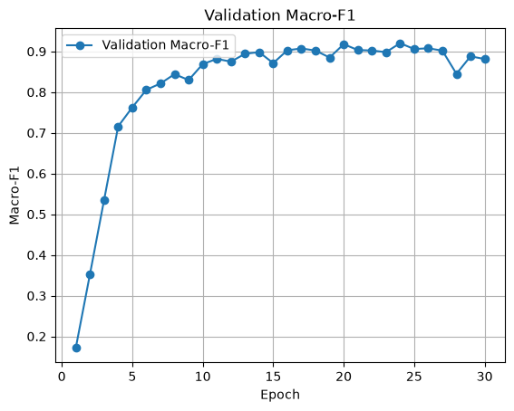

### Models
#### 1. ResNet-50
Why we chose ResNet-50 for this project:
- It’s a very common baseline backbone in image classification and medical imaging.
- It’s much more capable than ResNet-18/34, but still much lighter than ResNet-101/152.
- It has a good balance of accuracy, training speed, and GPU memory use.
- It makes a fair comparison with DenseNet-121 and Swin-T without making the experiment unnecessarily heavy.
- There are readily available ImageNet-pretrained weights, so we can fine-tune instead of training from scratch.

### Matrics
Since our dataset is imbalanced, I’d use validation macro-F1 as the main criterion rather than validation accuracy.

### ResNet-50 Baseline Training

#### Fixed Experimental Setup

- Model: ResNet-50
- Pretraining: ImageNet pretrained weights
- Train split: PanNuke Fold 1
- Validation split: PanNuke Fold 2
- Number of classes: 19
- Loss function: CrossEntropyLoss
- Input size: 256 × 256
- Normalization: ImageNet mean/std
- Checkpoint criterion: Best validation macro-F1

#### EX1
#### Hyperparameters and Training Configuration

- Batch size: 32
- Optimizer: Adam
- Learning rate: 1e-4
- epochs: 20
- Data augmentation: None
- Regularization: None

  
  

- Macro F1: 0.8671
- Training loss continued to decrease, while validation performance
peaked around epoch 9 and then began to plateau or worsen.
- The best checkpoint : 9th epoch
    - This indicates the onset of overfitting.

    - In the next experiment, data augmentation, regularization, and learning-rate adjustment will be explored to reduce overfitting.

#### EX2
- Batch size: 32
- Optimizer: Adam
- Learning rate: 1e-4
- epochs: 20
- Data augmentation: Yes
- Regularization: None

  
  

- Macro F1: 0.8942
- Validation performance remained stable through later epochs.
- The best checkpoint: 18th epoch
    - Data augmentation improved generalization and delayed overfitting.

    - In the next experiment, training will be extended to 30 epochs.

#### EX3
- Batch size: 32
- Optimizer: Adam
- Learning rate: 1e-4
- epochs: 30
- Data augmentation: Yes
- Regularization: None

  
  

- Best Val Macro-F1: 0.9203
- Best checkpoint: Epoch 24
- Validation Macro-F1 continued to improve after Epoch 20 and reached its highest value at Epoch 24.
    - Extending training from 20 to 30 epochs improved the best validation Macro-F1 from 0.8942 to 0.9203.
    - After Epoch 24, validation performance fluctuated without further improvement.
    - In the next experiment, the learning rate will be reduced to 5e-5 to achieve more stable optimization and potentially improve validation performance.

### References
[panNuke dataset](https://warwick.ac.uk/fac/cross_fac/tia/data/pannuke/)  
[pathml](https://github.com/Dana-Farber-AIOS/pathml)
